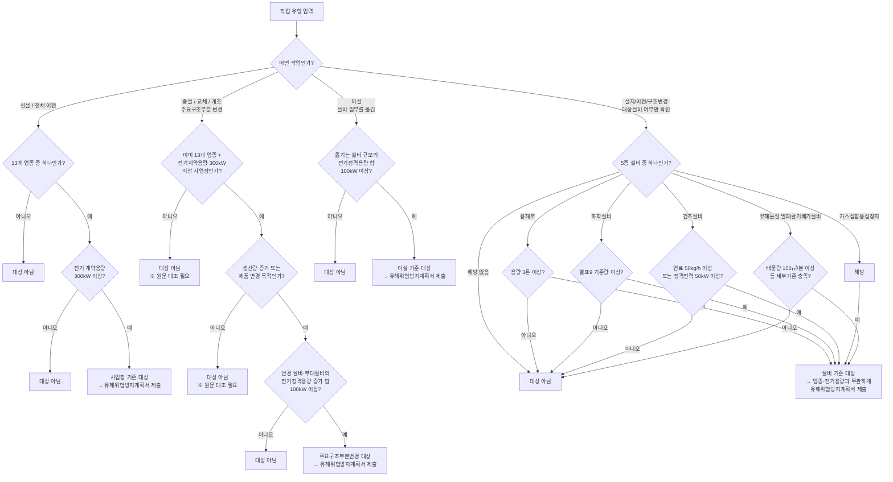

# 개념도 — 유해위험방지계획서 제출대상 판정 흐름

이 다이어그램은 REGULATION-NOTES.md의 조사 결과를 판정 트리로 정리한
**초안**이다. 아직 law.go.kr 원문 대조 전(🟡 2차자료 단계)이므로, engine.js
설계 시 반드시 원문 대조 후 재검증할 것. 여기 있는 kW 숫자는 확정이 아니다.

## 판정 결과가 여러 갈래에서 동시에 나올 수 있다

예: "반도체 제조업 사업장이 화학설비를 증설"하는 경우, 사업장 기준
(업종+전기계약용량)과 설비 기준(화학설비 별표9 기준량)이 동시에
검토되어야 한다. 이 도구는 **하나의 확정 판정이 아니라, 해당하는 모든
경로를 각각 판정해 보여주는 방식**으로 설계한다 —
safety-cert-checker가 안전인증/자율안전확인/안전검사 3개 제도를
동시에 판정해 보여주는 것과 같은 패턴.

## Engine 설계 시 참고

- Input: 작업유형(신설/이전/이설/증설·교체·개조), 업종코드, 전기
  계약용량(kW), 변경 전/후 전기정격용량(증감 계산용), 5종 설비 해당여부
  및 각 설비별 세부 수치(용해로 용량, 화학물질 종류/양, 건조설비 열원
  종류/소비전력 등)
- Engine: 위 트리를 그대로 pure function으로 구현, 각 경로(사업장기준/
  이설기준/설비기준)를 독립적으로 판정
- Report: 해당하는 모든 경로와 그 근거 조문을 함께 표시
